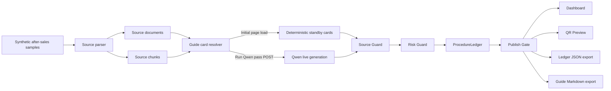

# TraceCue Agent

**TraceCue Agent** is the public **WorkCue Open / Qwen Cloud** reference implementation for source-grounded equipment after-sales QR guide generation.

It turns synthetic operational source material into reviewable guide cards, proves where each instruction came from, and blocks unsupported or risky steps before a QR guide reaches a frontline user.

> Core promise: every generated guide card must either show its source trail or be blocked / marked for expert review before publishing.

## WorkCue Open relationship

WorkCue is the commercial product line. TraceCue is the public WorkCue Open reference slice built with Qwen Cloud so reviewers can inspect a safe, synthetic implementation of source-grounded work-instruction generation.

This repository is public-safe by design. It may include synthetic data, public architecture notes, demo implementation code, and deployment guidance. It must not include private WorkCue strategy, real customer data, pricing, sales material, secrets, engine-vault material, private prompts, or internal prompt chains.

## Hackathon submission

TraceCue Agent is a public open-source hackathon repository for the **Global AI Hackathon Series with Qwen Cloud**.

Recommended track: **Track 4 — Autopilot Agent**.

Why this track fits:

- TraceCue automates a real operational workflow: turning scattered after-sales source evidence into publishable frontline guidance.
- It handles ambiguous or risky source material through review-required and blocked states.
- It keeps a human-in-the-loop checkpoint before unsupported instructions can reach a QR guide.
- It can use Qwen live generation on explicit demo runs while retaining deterministic standby as the safe replay path.

## Problem

Equipment after-sales teams often rely on maintenance notes, filter replacement steps, fault triage rules, support escalation guidance, safety limits, and warranty-boundary reminders. Those sources are useful, but turning them into clean frontline QR instructions is slow and risky.

A generic AI document generator can produce polished procedures, but it may invent unsupported repairs, flatten safety boundaries, imply warranty authority, or publish guidance without evidence.

TraceCue focuses on a narrower and safer workflow:

```text
Can this guide card prove where it came from?
If not, should it be reviewed or blocked before QR publication?
```

## What TraceCue does

The current demo creates an **Equipment After-sales QR Guide** from a synthetic source pack.

It demonstrates:

- **Synthetic source parsing** — public-safe markdown samples become source documents and source chunks.
- **Guide card generation** — deterministic standby cards keep the demo replayable; the `Run Qwen pass` button can trigger one explicit Qwen live generation request when server-side credentials and runtime flags are configured.
- **Source trail** — each guide card carries source references such as `filter-replacement#03`, `fault-triage#02`, or `warranty-boundaries#01`.
- **Source Guard** — cards with missing or invalid evidence are marked for review or blocked.
- **Risk Guard** — risky language around safety limits, unsupported repair, escalation, warranty boundaries, or service authority is flagged.
- **Publish Gate** — cards are classified as `publishable`, `needs_review`, or `blocked` before the QR guide preview.
- **ProcedureLedger** — source coverage, missing-source steps, risk flags, review status, publish status, feedback, revision proposal, generation mode, and model are recorded.
- **QR Preview** — a mobile-style guide preview shows what a frontline user could open from a QR code, while review-only and blocked cards are withheld.
- **Demo-local review actions** — reviewers can mark cards as approved, needs expert review, or blocked in the current browser session. Approval does not override Source Guard, high-severity Risk Guard, or explicit blocked decisions.
- **JSON ledger export** — the current ProcedureLedger, guarded cards, source snapshot, generation metadata, and review session can be exported for inspection.
- **Markdown guide export** — a readable guide artifact can be exported with publishable steps, source proof, withheld-card notes, and generation metadata.

## Architecture



Qwen generation is intentionally isolated behind the resolver. Initial homepage rendering uses deterministic standby by default so passive requests, health checks, crawlers, refreshes, or accidental visits do not create model usage. The live path runs through an explicit POST from the `Run Qwen pass` button, and invalid Qwen output still falls back to deterministic cards before passing through Source Guard, Risk Guard, ProcedureLedger, and Publish Gate.

## Qwen Cloud usage

TraceCue uses Qwen through an OpenAI-compatible server-side chat completion request.

Default runtime behavior:

```text
QWEN_LIVE_GENERATION=false
QWEN_ALLOW_PAGE_LOAD_LIVE_GENERATION=false
```

This keeps the public demo stable when reviewers clone the repo without credentials and prevents passive homepage requests from creating model usage.

To test live Qwen generation through the `Run Qwen pass` button, configure server-side environment variables:

```env
QWEN_API_KEY=
DASHSCOPE_API_KEY=
QWEN_BASE_URL=https://dashscope-intl.aliyuncs.com/compatible-mode/v1
QWEN_MODEL_CHAIN=qwen3.7-max,qwen3.7-plus,qwen3.6-plus,qwen3.6-flash,qwen3.5-plus,qwen3.5-flash
QWEN_LIVE_GENERATION=true
QWEN_ALLOW_PAGE_LOAD_LIVE_GENERATION=false
```

`QWEN_ALLOW_PAGE_LOAD_LIVE_GENERATION=true` is only for special homepage-render smoke tests. It is not required for the button-triggered demo and should stay `false` in normal deployment.

Rules:

- Prefer `QWEN_API_KEY`; `DASHSCOPE_API_KEY` is supported as a fallback.
- Do not expose model credentials through `NEXT_PUBLIC_*` variables.
- Do not commit `.env.local` or deployment secrets.
- Keep `QWEN_ALLOW_PAGE_LOAD_LIVE_GENERATION=false` unless intentionally testing live generation on homepage render.
- Use `Run Qwen pass` for explicit one-time live generation.
- Use `QWEN_MODEL_CHAIN` to configure free-quota model rotation order.
- Qwen-generated cards must include valid `sourceRefs`; invalid cards fall back to deterministic cards.
- All cards still pass through Source Guard, Risk Guard, ProcedureLedger, and Publish Gate.

## Model-chain quota guard

TraceCue can rotate through a configured Qwen model chain. The default order is:

```text
qwen3.7-max > qwen3.7-plus > qwen3.6-plus > qwen3.6-flash > qwen3.5-plus > qwen3.5-flash
```

If a model returns a free-tier quota exhaustion response, TraceCue tries the next configured model. If every configured model is exhausted, the generation mode becomes `qwen_quota_paused` and the dashboard displays:

```text
Generation: Free quota exhausted
```

That paused state is intentionally different from deterministic standby. It means live generation was paused to avoid billable usage until quota is available again or the operator changes the model chain.

## Current demo scope

Included:

- One focused scenario: **Equipment After-sales QR Guide**.
- Synthetic after-sales markdown samples under `samples/equipment-after-sales/`.
- Deterministic standby guide cards for repeatable page load.
- Button-triggered Qwen live generation for controlled demos.
- Free-quota model-chain rotation and `qwen_quota_paused` state.
- Source Guard and Risk Guard.
- ProcedureLedger.
- Publish Gate.
- QR Preview with blocked and review-only cards withheld.
- Demo-local review actions.
- Exportable ProcedureLedger JSON.
- Exportable guide Markdown.
- Alibaba Cloud deployment notes.
- Visual QA checklist for desktop, mobile, generation-state, QR Preview, and export proof.

Not included in this public slice:

- Authentication.
- Billing.
- Multi-tenant SaaS behavior.
- Database persistence.
- PDF upload or OCR.
- QR image upload or decoding.
- Multiple production customer scenarios.
- Real customer data.

## Demo flow

Recommended three-minute walkthrough:

1. Open the dashboard and show the safe initial deterministic standby state.
2. Click `Run Qwen pass` to trigger a single explicit Qwen live generation request when the runtime is configured.
3. Show guide cards with equipment after-sales source references.
4. Apply demo-local review actions and explain that approval cannot override source or safety guards.
5. Open the Publish Gate and explain publishable / needs review / blocked states.
6. Open QR Preview and show that blocked or review-only cards are withheld from the frontline guide.
7. Show the ProcedureLedger proof trail, including generation mode and model.
8. Export the ledger JSON.
9. Export the guide Markdown.
10. Explain deterministic standby and `qwen_quota_paused` as safety states for repeatability and quota protection.

See [`docs/visual-qa-checklist.md`](docs/visual-qa-checklist.md) for screenshot and artifact checks before submission or demo recording.

## Run locally

```bash
corepack enable
pnpm install
pnpm dev
```

Open:

```text
http://localhost:3000
```

## Validate

```bash
pnpm typecheck
pnpm build
pnpm lint
```

Or run the combined check:

```bash
pnpm check
```

The app does not require a database for the demo slice.

## Runtime config

Create a local environment file:

```bash
cp runtime.example .env.local
```

Default public-safe config:

```env
QWEN_API_KEY=
DASHSCOPE_API_KEY=
QWEN_BASE_URL=https://dashscope-intl.aliyuncs.com/compatible-mode/v1
QWEN_MODEL_CHAIN=qwen3.7-max,qwen3.7-plus,qwen3.6-plus,qwen3.6-flash,qwen3.5-plus,qwen3.5-flash
QWEN_LIVE_GENERATION=false
QWEN_ALLOW_PAGE_LOAD_LIVE_GENERATION=false
NEXT_PUBLIC_APP_NAME=TraceCue Agent
```

With the default config, TraceCue runs deterministic standby cards and does not call Qwen.

## Alibaba Cloud deployment

See [`docs/alibaba-cloud-deployment.md`](docs/alibaba-cloud-deployment.md) for deployment notes, runtime variables, model-chain quota guard, cost guard, and smoke checks.

Recommended public deployment path:

- Run TraceCue as a standard Next.js Node service on Alibaba Cloud.
- Keep homepage page-load generation disabled by default.
- Enable Qwen live generation for controlled demos with server-side credentials configured in the deployment runtime.
- Use the `Run Qwen pass` button for explicit one-time live generation.
- Verify deterministic standby on initial page load unless a controlled smoke test intentionally enables page-load live generation.
- Verify that no API key appears in the page source, browser console, exported JSON, exported Markdown, README, or docs.

Deployment proof should show the dashboard, generation state, ProcedureLedger, QR Preview, and successful exports without exposing secrets or private cloud identifiers.

## Visual QA and export proof

Use [`docs/visual-qa-checklist.md`](docs/visual-qa-checklist.md) before submission, demo recording, or a customer-facing rehearsal.

Recommended evidence to capture:

- Desktop deterministic standby page load.
- Explicit `Run Qwen pass` result when a safe configured environment is available.
- `Free quota exhausted` state only if naturally reproducible or available in a safe test environment.
- Guide cards with source references, guard badges, and review actions.
- Publish Gate grouping.
- QR Preview mobile-style guide and withheld notice.
- Exported ProcedureLedger JSON inspected for generation metadata, source snapshot, guarded cards, review session, and no secrets.
- Exported guide Markdown inspected for source references, withheld-card notes, generation metadata, and no secrets.

## Public repo boundary

This repository may include:

- Synthetic sample data.
- Public-safe architecture notes.
- Demo implementation code.
- High-level product language.
- Deployment notes.
- Submission preparation materials.

This repository must not include:

- Real customer data or customer documents.
- Private WorkCue strategy.
- Private prompts or internal prompt chains.
- Engine-vault material.
- Internal planning material or private roadmap content.
- Pricing or sales playbooks.
- Alibaba Cloud account credentials, API keys, private workspace IDs, or deployment secrets.

## Project structure

```text
app/
  api/run-demo/route.ts              # Explicit POST endpoint for one-time Run Qwen pass generation
  page.tsx                           # Server page that resolves safe initial cards and renders the dashboard
src/components/
  TraceCueDashboard.tsx              # Evidence console, Publish Gate, QR Preview, review actions, and exports
src/lib/
  demo-data.ts                       # Deterministic standby guide cards
  guards.ts                          # Source Guard, Risk Guard, ProcedureLedger helpers
  guide-export.ts                    # Markdown guide export builder
  qwen.ts                            # Server-side Qwen adapter with deterministic fallback and page-load cost guard
  source-parser.ts                   # Markdown source parser
  source-samples.ts                  # Synthetic sample loader
  types.ts                           # Shared TypeScript types
samples/equipment-after-sales/        # Synthetic after-sales markdown inputs
docs/
  alibaba-cloud-deployment.md         # Public-safe deployment notes and smoke checks
  visual-qa-checklist.md              # Screenshot, generation-state, QR Preview, and export QA checklist
```

## Submission readiness checklist

Before final submission, verify:

- Public repository URL is available.
- `LICENSE` is visible in the repository.
- Architecture diagram is included in this README.
- Main demo video is public and focused on the Equipment After-sales QR Guide scenario.
- Alibaba Cloud deployment proof is prepared if required by the submission form.
- Visual QA screenshots and export artifacts have been inspected for secrets.
- Devpost text description explains the features and functionality.
- Track is identified as **Track 4 — Autopilot Agent**.
- No secrets, customer data, private prompts, private WorkCue strategy, pricing, engine-vault material, or internal planning material are visible.

## License

Apache License 2.0. See [`LICENSE`](LICENSE).
