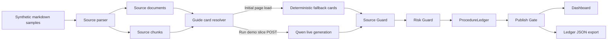

# TraceCue Agent

**TraceCue Agent** is a source-grounded procedure guide autopilot for small teams.

It turns operational source notes into reviewable guide cards, then uses Source Guard, Risk Guard, ProcedureLedger, and Publish Gate to decide whether each card is safe to publish.

> Core promise: every generated guide card must either show its source trail or be blocked / marked for review before publishing.

## Hackathon submission

TraceCue Agent is a public open-source hackathon repository for the **Global AI Hackathon Series with Qwen Cloud**.

Recommended track: **Track 4 — Autopilot Agent**.

Why this track fits:

- TraceCue automates a real business workflow: turning scattered procedure evidence into publishable operating guidance.
- It handles ambiguous source material through review-required and blocked states.
- It keeps a human-in-the-loop checkpoint before risky or unsupported instructions can ship.
- It can use Qwen live generation on explicit demo runs while retaining deterministic fallback as a safety path.

## Problem

Small teams often rely on scattered handoff notes, support policies, meeting transcripts, checklists, and internal reminders. Those sources are useful, but turning them into clean client-facing procedures is slow and error-prone.

A generic AI document generator can produce polished instructions, but it may also invent unsupported steps, flatten review-sensitive commitments, or publish guidance without evidence.

TraceCue focuses on a narrower and safer workflow:

```text
Can this guide card prove where it came from?
If not, should it be reviewed or blocked before publishing?
```

## What TraceCue does

The current demo creates a **Client Handoff Guide** from synthetic source documents.

It demonstrates:

- **Synthetic source parsing** — markdown samples become source documents and source chunks.
- **Guide card generation** — deterministic fallback cards keep the demo replayable; the `Run demo slice` button can trigger one explicit Qwen live generation request when server-side credentials are configured.
- **Source trail** — each guide card carries source references such as `handoff-notes#01` or `meeting-transcript#01`.
- **Source Guard** — cards with missing evidence are marked for review.
- **Risk Guard** — risky language around payment, support, access, or agreement-sensitive content is flagged.
- **Publish Gate** — cards are classified as `publishable`, `needs_review`, or `blocked`.
- **ProcedureLedger** — source coverage, missing-source steps, risk flags, review status, publish status, feedback, and revision proposal are recorded.
- **JSON export** — the ledger and guarded cards can be exported for inspection.

## Architecture



Qwen generation is intentionally isolated behind the resolver. Initial homepage rendering uses deterministic fallback by default so passive requests, health checks, crawlers, or accidental visits do not create model usage. The live path runs only through an explicit POST from the `Run demo slice` button, and invalid Qwen output still falls back to deterministic cards before passing through the guardrail pipeline.

## Qwen Cloud usage

TraceCue uses Qwen through an OpenAI-compatible server-side chat completion request.

Default runtime behavior:

```text
QWEN_LIVE_GENERATION=false
QWEN_ALLOW_PAGE_LOAD_LIVE_GENERATION=false
```

This keeps the public demo stable when judges clone the repo without credentials and prevents passive homepage requests from creating model usage.

To test live Qwen generation through the `Run demo slice` button, configure server-side environment variables:

```env
QWEN_API_KEY=
DASHSCOPE_API_KEY=
QWEN_BASE_URL=https://dashscope-intl.aliyuncs.com/compatible-mode/v1
QWEN_MODEL=qwen3.7-plus
QWEN_LIVE_GENERATION=true
QWEN_ALLOW_PAGE_LOAD_LIVE_GENERATION=false
```

`QWEN_ALLOW_PAGE_LOAD_LIVE_GENERATION=true` is only for special homepage-render smoke tests. It is not required for the button-triggered demo and should stay `false` in normal deployment.

Rules:

- Prefer `QWEN_API_KEY`; `DASHSCOPE_API_KEY` is supported as a fallback.
- Do not expose model credentials through `NEXT_PUBLIC_*` variables.
- Do not commit `.env.local` or deployment secrets.
- Keep `QWEN_ALLOW_PAGE_LOAD_LIVE_GENERATION=false` unless intentionally testing live generation on homepage render.
- Qwen-generated cards must include valid `sourceRefs`; invalid cards fall back to deterministic cards.
- All cards still pass through Source Guard, Risk Guard, ProcedureLedger, and Publish Gate.

## Current demo scope

Included:

- One focused scenario: **Client Handoff Guide**.
- Synthetic markdown samples under `samples/`.
- Deterministic fallback guide cards.
- Button-triggered Qwen live generation for controlled demos.
- Source Guard and Risk Guard.
- ProcedureLedger.
- Publish Gate.
- Dashboard with source coverage, guarded cards, review states, and exportable JSON.
- Alibaba Cloud deployment notes.
- Demo video script and screenshot checklist.

Not included in this hackathon slice:

- Authentication.
- Billing.
- Multi-tenant SaaS behavior.
- Database persistence.
- PDF upload or OCR.
- Multiple production customer scenarios.
- Real customer data.

## Demo flow

Recommended three-minute walkthrough:

1. Open the dashboard and show the safe initial deterministic fallback state.
2. Click `Run demo slice` to trigger a single Qwen live generation request.
3. Show guide cards with source references.
4. Open the Publish Gate and explain publishable / needs review / blocked states.
5. Show the ProcedureLedger.
6. Explain deterministic fallback as the safety path if Qwen is unavailable or returns invalid source references.
7. Export the ledger JSON.

See [`docs/demo-video-script.md`](docs/demo-video-script.md) for the full script and screenshot checklist.

## Run locally

```bash
corepack enable
pnpm install
pnpm dev
```

Open:

```text
http://localhost:3000
```

## Validate

```bash
pnpm typecheck
pnpm build
pnpm lint
```

The app does not require a database for the demo slice.

## Runtime config

Create a local environment file:

```bash
cp runtime.example .env.local
```

Default public-safe config:

```env
QWEN_API_KEY=
DASHSCOPE_API_KEY=
QWEN_BASE_URL=https://dashscope-intl.aliyuncs.com/compatible-mode/v1
QWEN_MODEL=qwen3.7-plus
QWEN_LIVE_GENERATION=false
QWEN_ALLOW_PAGE_LOAD_LIVE_GENERATION=false
NEXT_PUBLIC_APP_NAME=TraceCue Agent
```

With the default config, TraceCue runs deterministic fallback cards and does not call Qwen.

## Alibaba Cloud deployment

See [`docs/alibaba-cloud-deployment.md`](docs/alibaba-cloud-deployment.md) for deployment notes, runtime variables, cost guard, and smoke checks.

Recommended hackathon deployment path:

- Run TraceCue as a standard Next.js Node service on Alibaba Cloud.
- Keep homepage page-load generation disabled by default.
- Enable Qwen live generation for controlled demos with server-side credentials configured in the deployment runtime.
- Use the `Run demo slice` button for explicit one-time live generation.
- Verify that no API key appears in the page source, browser console, exported JSON, README, or docs.

## Public repo boundary

This repository may include:

- Synthetic sample data.
- Public-safe architecture notes.
- Demo implementation code.
- High-level product language.
- Deployment notes.
- Submission preparation materials.

This repository must not include:

- Real customer data or customer documents.
- Private WorkCue strategy.
- Private prompts or internal prompt chains.
- Internal planning material or private roadmap content.
- Pricing or sales playbooks.
- Alibaba Cloud account credentials, API keys, or private workspace IDs.

## Project structure

```text
app/
  api/run-demo/route.ts              # Explicit POST endpoint for one-time Qwen live generation
  page.tsx                           # Server page that resolves safe initial cards and renders the dashboard
src/components/
  TraceCueDashboard.tsx              # Main dashboard UI
src/lib/
  demo-data.ts                       # Deterministic fallback guide cards
  guards.ts                          # Source Guard, Risk Guard, ProcedureLedger helpers
  qwen.ts                            # Server-side Qwen adapter with deterministic fallback and page-load cost guard
  source-parser.ts                   # Markdown source parser
  source-samples.ts                  # Synthetic sample loader
  types.ts                           # Shared TypeScript types
samples/                             # Synthetic markdown inputs
docs/
  alibaba-cloud-deployment.md         # Public-safe deployment notes
  demo-video-script.md                # 3-minute demo script and screenshot checklist
```

## Submission readiness checklist

Before final Devpost submission, verify:

- Public repository URL is available.
- `LICENSE` is visible in the repository.
- Architecture diagram is included in this README.
- Main demo video is public and about three minutes.
- Alibaba Cloud deployment proof is prepared if required by the submission form.
- Devpost text description explains the features and functionality.
- Track is identified as **Track 4 — Autopilot Agent**.
- No secrets, customer data, private prompts, or internal planning material are visible.

## License

Apache License 2.0. See [`LICENSE`](LICENSE).