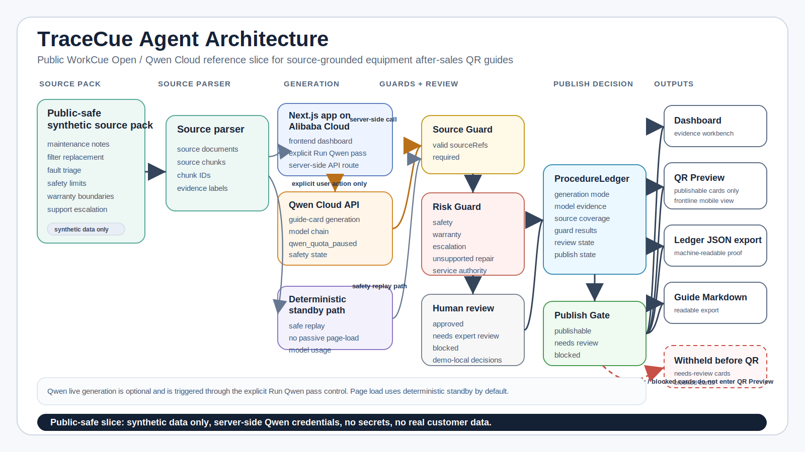

# TraceCue Agent architecture diagram

This page documents the public architecture diagram for the TraceCue submission package. The diagram shows how the public WorkCue Open / Qwen Cloud reference slice turns synthetic equipment after-sales source material into reviewed, gated, exportable QR guide artifacts.



## Architecture flow

```text
Synthetic equipment after-sales samples -> source parser -> Qwen generation or deterministic standby -> Source Guard -> Risk Guard -> Human Review -> ProcedureLedger -> Publish Gate -> Dashboard, QR Preview, ledger JSON export, and guide Markdown export
```

The slice starts with public-safe synthetic source samples for maintenance notes, filter replacement, fault triage, safety limits, warranty boundaries, and support escalation. The source parser converts those samples into source documents and source chunks. Source context then feeds either the optional live Qwen path or the deterministic standby path.

Generated or standby guide cards pass through Source Guard, Risk Guard, human review, ProcedureLedger, and Publish Gate before reaching outputs. The QR Preview receives only publishable cards; needs-review and blocked cards remain withheld from the frontline preview and are preserved as proof records in the ledger and exports.

## Qwen Cloud usage notes

- Live Qwen generation is triggered by the explicit `Run Qwen pass` action.
- Qwen credentials are server-side only and are never exposed in browser code, exports, screenshots, or docs.
- Passive page-load model usage is disabled by default; the initial page load uses deterministic standby unless a controlled smoke test intentionally opts into page-load live generation.
- `QWEN_MODEL_CHAIN` controls the model rotation strategy for free-quota-aware demos.
- `qwen_quota_paused` / `Free quota exhausted` is a safety state that pauses live generation when the configured free quota is exhausted instead of silently pretending generation succeeded or continuing into unexpected billable usage.

## Public safety boundary

This diagram and the linked SVG are public-safe submission assets. They describe a public reference slice and technical showcase, not a complete production SaaS platform.

The public boundary is:

- synthetic samples only
- no secrets
- no real customer data
- no private WorkCue strategy
- no engine-vault material
- no private prompts
- no API keys or `.env.local` content

The current public slice does not claim database persistence, authentication, billing, QR image decoding, PDF OCR, real customer integration, or multi-tenant SaaS behavior.
