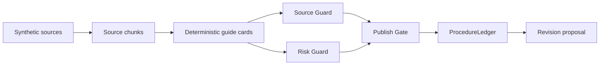

# TraceCue Architecture

## P0 flow

## Why this is enough for the first demo

The demo must prove that TraceCue is not a generic AI document generator. It must prove that every step has source and governance metadata.

## Later Qwen integration

After the deterministic demo is stable, use Qwen for:

1. procedure graph generation
2. guide card drafting
3. revision proposal drafting

Keep deterministic checks for Source Guard, Risk Guard, Publish Gate, and ProcedureLedger.
